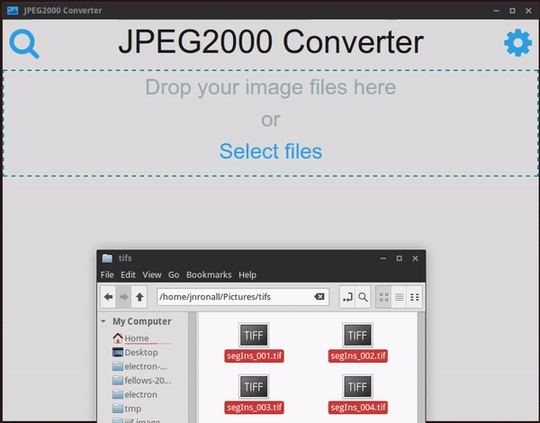

# JPEG2000 Converter

> A GUI for creating JPEG2000 images suitable for a IIIF image server

Written using Electron. Proof of concept.

**Convert images to JP2**


**View any JP2 in OpenSeadragon**


## Requirements

In order to use this tool you will need to meet the following requirements first.

**JP2 binary**: You must have a JPEG2000 compression binary installed. The application works with either the open source OpenJPEG2 (opj_compress) or the proprietary Kakadu (kdu_compress) binaries. See the notice below for more information on Kakadu binaries.

**libvips**: For Mac OSX you will also need to [install libvips for sharp](http://sharp.dimens.io/en/stable/install/). Linux and Windows ought to already have libvips installed.

**convert**: Currently you will also need to have the Imagemagick `convert` command available in order to convert as many different source image formats into a tiff suitable for the JP2 binaries.

**tiff2rgba**: The `tiff2rgba` ensures that the tiff that the JP2 binary processes will be in a colorspace that it understands.

Yes, that's a lot of dependencies that need to be installed. Yes, if this project continues I'll be looking to:

1. Create comprehensive install instructions for each target platform.
2. Develop install scripts for each target platform that are embedded within the application itself.
3. Ship with pre-compiled binaries in cases where that is possible.

## Install

While this is probably in a pre-alpha state, please do give it a try and file issues.

You can either clone the repo and follow the development instructions below or [install one of the pre-alpha packages](https://drive.google.com/folderview?id=0ByUq6R632zOwdkhiN3QwSHpoZzg&usp=sharing).

When you first run the application you'll be brought to the setup window where you can select an output directory (must exist) and which JP2 binary  you will be using for the conversion (select one you have installed).

## Development

Clone the repo and do:

```shell
npm install
```

### Run

```shell
npm start
```

### Watch and Compile

```shell
npm run foreman
```

### Build for release

```shell
npm run build:linux
npm run build:win
```

You should find a deb package in dist/linux and Windows installer in dist/win.

Builds the app for OS X, Linux, and Windows, using [electron-packager](https://github.com/maxogden/electron-packager).

## TODO
- Add thumbnail images async
- Create a video showing how this works
- Animate or highlight "all done" when images are finished processing
- after processing is complete for a file do some checks to make sure the JP2 has been created correctly. Size, `file`, what else?
- Allow for automatically installing dependencies if they are not installed
- Instead of requiring the user to click a button to relaunch the application just open the index page when the executables are installed?

## Kakadu Copyright Notice and Disclaimer
In order to use the "kdu" extractor option, you will need to install the Kakadu binaries/executables available [here](http://kakadusoftware.com/downloads/). Those executables are made available for demonstration purposes only. Neither the author, Dr. Taubman, nor UNSW Australia accept any liability arising from their use or re-distribution.

That site states:

> Copyright is owned by NewSouth Innovations Pty Limited, commercial arm of the UNSW Australia in Sydney. **You are free to trial these executables and even to re-distribute them, so long as such use or re-distribution is accompanied with this copyright notice and is not for commercial gain. Note: Binaries can only be used for non-commercial purposes.** If in doubt please contact the Kakadu Team at info@kakadusoftware.com.


## Author

Jason Ronallo

## License

MIT © North Carolina State University
